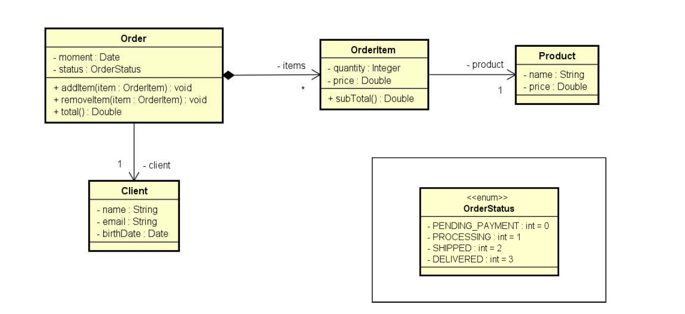

# Order Status

> Ler os dados de um pedido com N itens (N fornecido pelo usuário). Depois, mostrar um sumário do pedido conforme exemplo (próxima página).

.jpg)

Neste exercício, foi colocado em prática o conceito de __enums__.