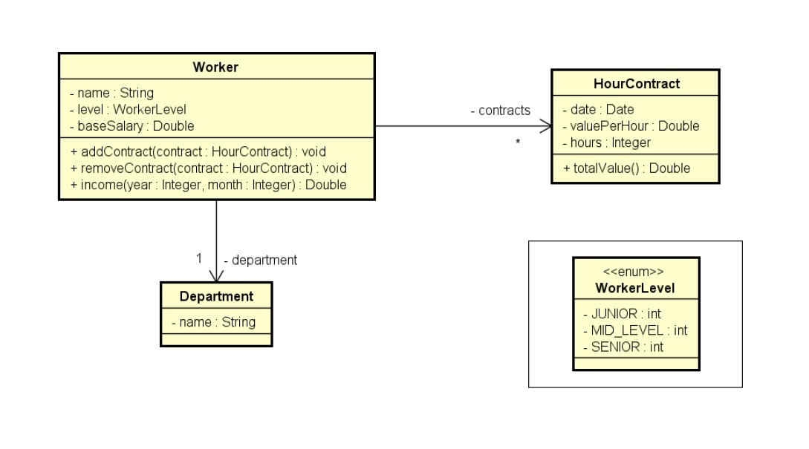

# Enums (Contract)

> Ler os dados de um trabalhador com N contratos (N fornecido pelo usuário). Depois, solicitar do usuário um mês e mostrar qual foi o salário do funcionário nesse mês, conforme exemplo

.jpg)

Neste exercício, foi colocado em prática o conceito de __enums__.